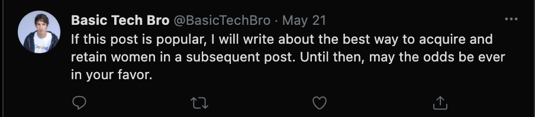
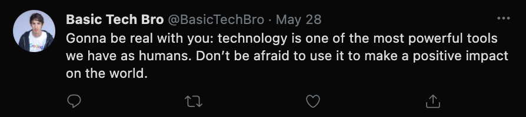
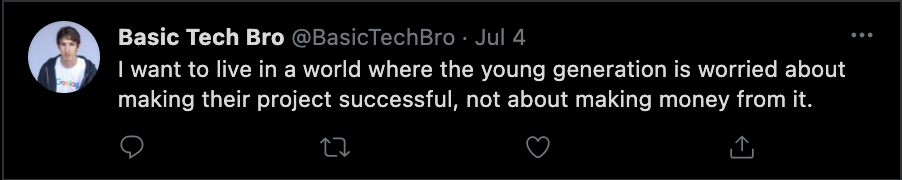
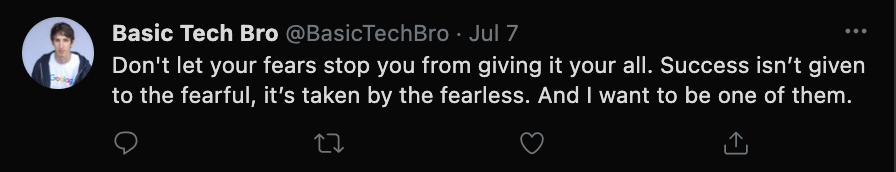

# BasicTechBro

A bot that tweets like a basic tech bro every so often, powered by GPT3

I trained it on tweets by Sam Altman, Paul Graham and Keith Rabois so it basically generates stuff in a similar vein to them - broad, sweeping statements that
that sound useful or inspiring but are actually meaningless. Here's some examples:

